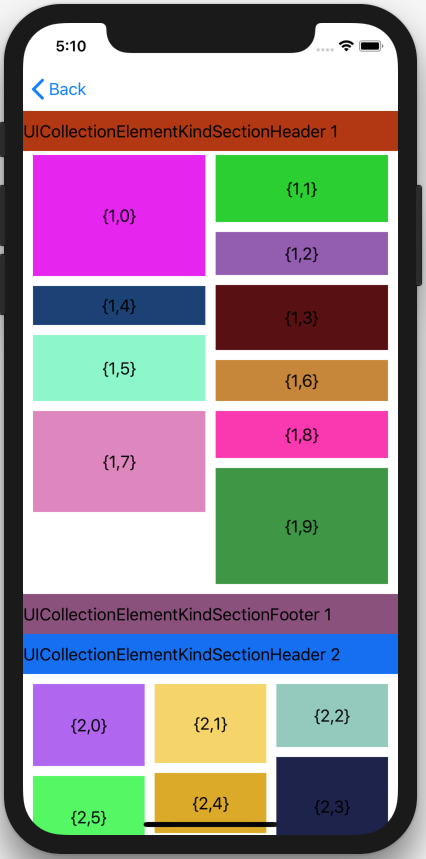
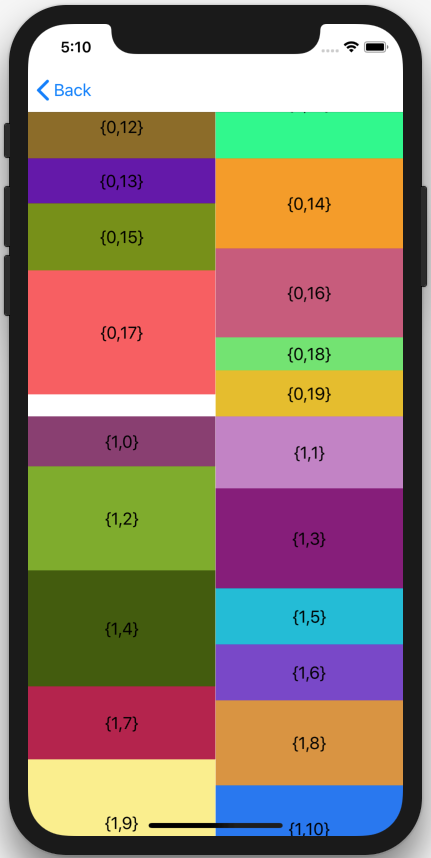

# iOS-WaterfallLayout

[]()
[]()
[]()
[]()


使用 UICollectionView + UICollectionViewLayout 实现瀑布流布局


## 特性

- 提供和 UICollectionViewFlowLayout 基本一致的API，更容易上手
- 可直接在 Storyboard 通过拖线方式设置数据源
- 不同分组可以指定不同的列数
- 分组头部视图悬停(总感觉有点小问题，欢迎你提pull request)
- 不同分组可以设置不同的间距(行之间/列之间)和四周留白区域
- 部分属性提供全局设置，但是你也可以通过数据源的方法返回不同的值进行覆盖


## 环境要求

- iOS8.0+
- Xcode9.0+


## 用法

- 将 `XPCollectionViewWaterfallFlowLayout.{h/m}` 拖入项目
- 设置 UICollectionView 的 collectionViewLayout 为 XPCollectionViewWaterfallFlowLayout
- 设置数据源并实现相关方法


## XPCollectionViewWaterfallFlowLayoutDataSource 数据源方法说明

- 要求必须实现的方法有两个:

返回第 section 组对应的列数，必须大于0
```ObjC
- (NSInteger)collectionView:(UICollectionView *)collectionView layout:(XPCollectionViewWaterfallFlowLayout*)layout numberOfColumnInSection:(NSInteger)section;
```
返回 indexPath 对应的 item 的高度
```ObjC
- (CGFloat)collectionView:(UICollectionView *)collectionView layout:(XPCollectionViewWaterfallFlowLayout*)layout itemWidth:(CGFloat)width
 heightForItemAtIndexPath:(NSIndexPath *)indexPath;
```

- 以下方法为可选，作用和 UICollectionViewDelegateFlowLayout 一致
```ObjC
- (CGFloat)collectionView:(UICollectionView *)collectionView layout:(XPCollectionViewWaterfallFlowLayout*)layout minimumLineSpacingForSectionAtIndex:(NSInteger)section;

- (CGFloat)collectionView:(UICollectionView *)collectionView layout:(XPCollectionViewWaterfallFlowLayout*)layout minimumInteritemSpacingForSectionAtIndex:(NSInteger)section;

- (UIEdgeInsets)collectionView:(UICollectionView *)collectionView layout:(XPCollectionViewWaterfallFlowLayout*)layout insetForSectionAtIndex:(NSInteger)section;

- (CGFloat)collectionView:(UICollectionView *)collectionView layout:(XPCollectionViewWaterfallFlowLayout*)layout referenceHeightForHeaderInSection:(NSInteger)section;

- (CGFloat)collectionView:(UICollectionView *)collectionView layout:(XPCollectionViewWaterfallFlowLayout*)layout referenceHeightForFooterInSection:(NSInteger)section;
```


## 演示

[]()

[]()

[]()

## 致谢

- [WaterfallCollectionView](https://github.com/SureCase/WaterfallCollectionView.git)

感谢他们对开源社区做出的贡献。

## 协议

被许可在 MIT 协议下使用，查阅`LICENSE`文件来获得更多信息。
